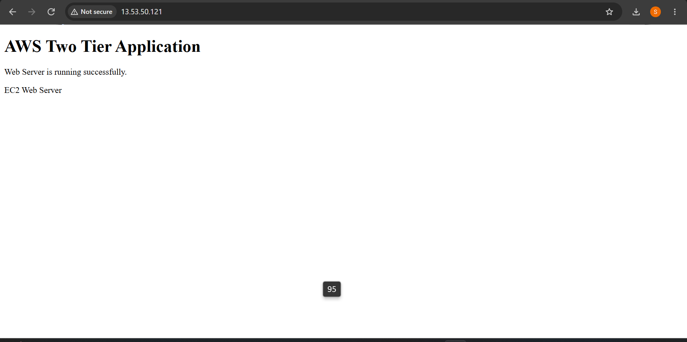
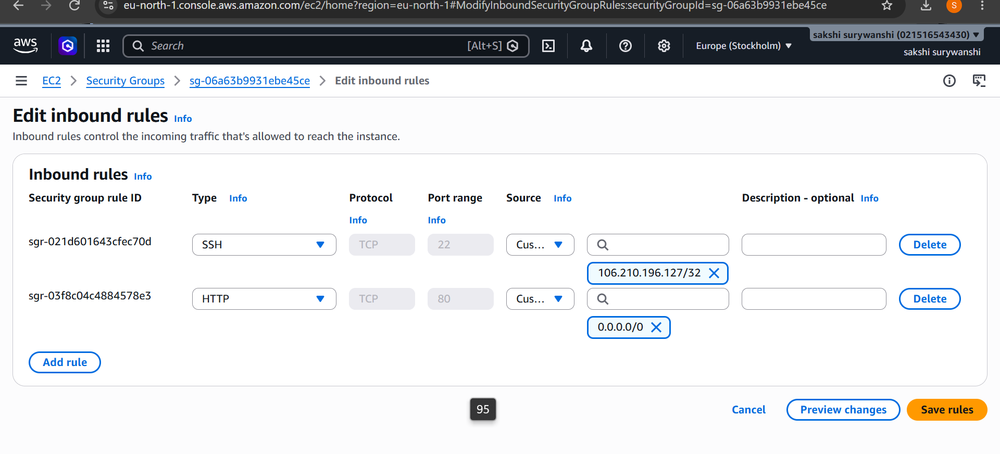
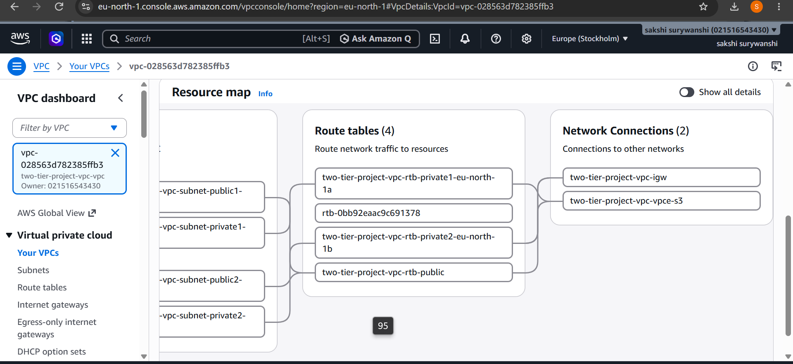
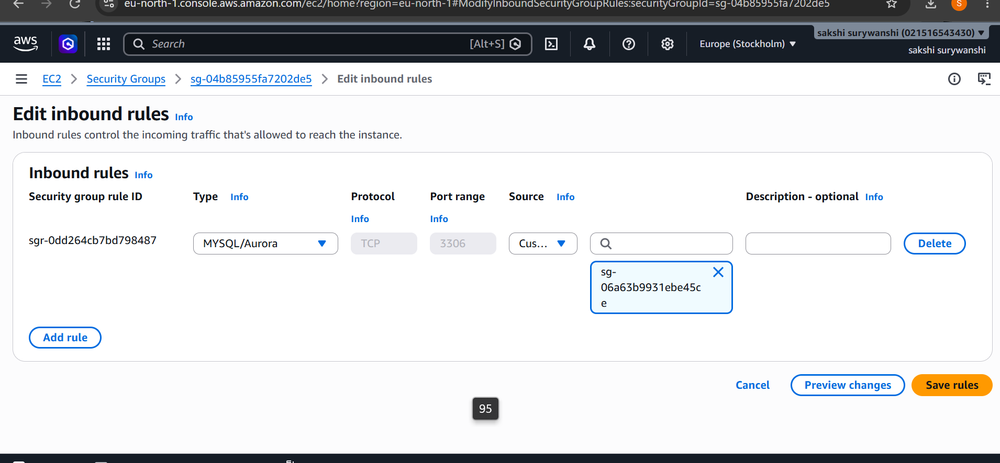
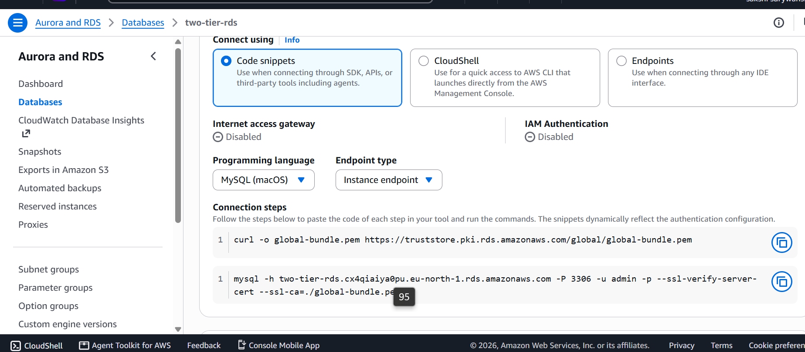
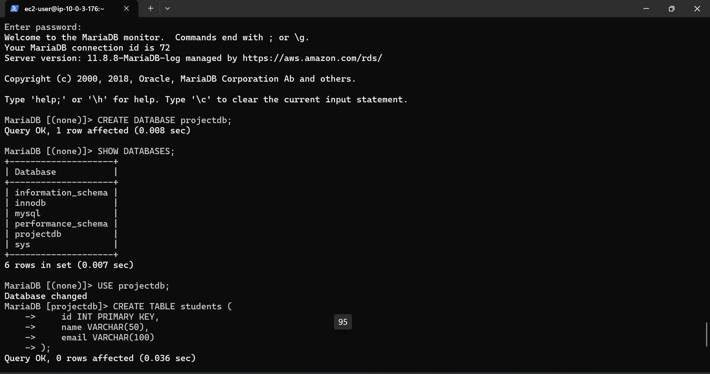
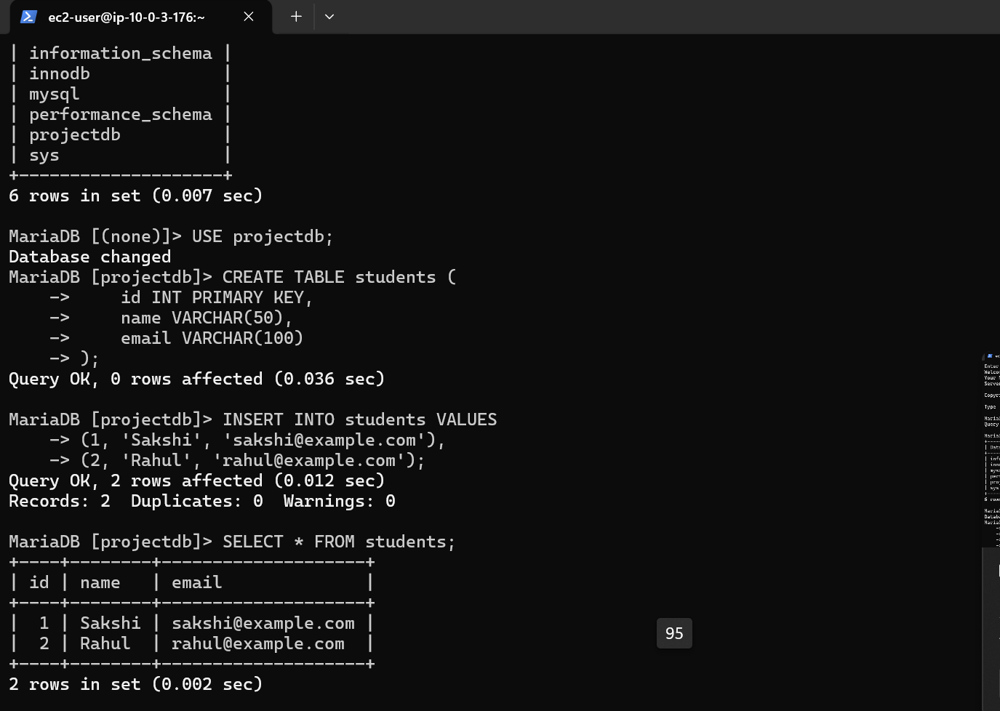
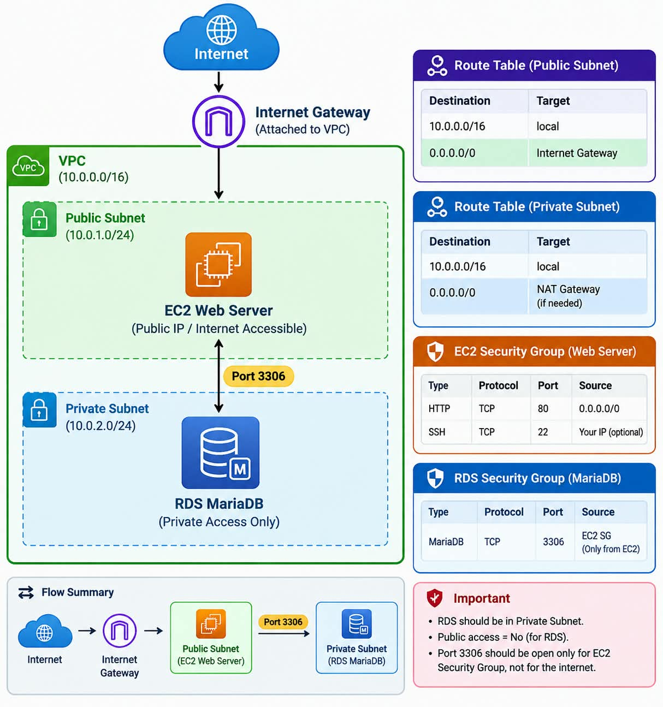

# AWS Two-Tier Web Application using EC2 and RDS

## 1. Project Title

**AWS Two-Tier Web Application using Amazon EC2 and Amazon RDS**

## 2. Objective

The objective of this project is to create a secure two-tier web application architecture using Amazon EC2 as the web/application server and Amazon RDS as the database server.

The EC2 server is placed in a public subnet, while the RDS database is placed in private subnets. Database access is restricted to the EC2 server through a dedicated Security Group.

## 3. AWS Services Used

- Amazon VPC
- Amazon EC2
- Amazon RDS
- Security Groups
- Internet Gateway
- MariaDB

## 4. VPC Configuration

**VPC Name:** `two-tier-project-vpc-vpc`  
**VPC ID:** `vpc-028563d782385ffb3`  
**IPv4 CIDR:** `10.0.0.0/16`  
**Region:** `eu-north-1`

The VPC contains:

- 2 Public Subnets
- 2 Private Subnets
- Internet Gateway
- Route Tables

The EC2 web server is deployed in a public subnet, while the RDS database is deployed using private subnets.

### Screenshot


## 5. VPC Resource Map

The VPC resource map shows the public and private subnets, route tables and Internet Gateway used in the two-tier architecture.

### Screenshot


## 6. EC2 Web Server Configuration

**Instance Name:** `two-tier-web-server`

Apache HTTP Server was installed on the EC2 instance:

```bash
sudo dnf install httpd -y
sudo systemctl start httpd
sudo systemctl enable httpd
```

A web page was created in `/var/www/html/index.html`.

The web page displays:

- AWS Two Tier Application
- Web Server is running successfully.
- EC2 Web Server

### Screenshot


### Web Page Screenshot



## 7. EC2 Security Group

**Security Group:** `two-tier-ec2-sg`

| Type | Port | Source |
|---|---:|---|
| SSH | 22 | My IP |
| HTTP | 80 | 0.0.0.0/0 |

### Screenshot



## 8. RDS Database Configuration

**DB Instance Identifier:** `two-tier-rds`  
**Database Engine:** MariaDB  
**Instance Class:** `db.t4g.micro`  
**Port:** `3306`  
**Public Access:** No

The RDS database is configured inside the same VPC and is not publicly accessible.

### Screenshot



## 9. RDS Security Group

**Security Group:** `two-tier-rds-sg`

| Type | Port | Source |
|---|---:|---|
| MySQL/Aurora | 3306 | `two-tier-ec2-sg` |

The database accepts connections only from the EC2 Security Group.

### Screenshot



## 10. RDS Connectivity

The RDS database uses port `3306` and is not publicly accessible. The RDS endpoint was used from the EC2 instance to establish a secure database connection.

### Screenshot



### EC2 to RDS Connection

The MariaDB client was installed on EC2 and the RDS endpoint was used to connect securely to the database.

### Screenshot



## 11. Database Testing

A database named `projectdb` was created.

```sql
CREATE DATABASE projectdb;
USE projectdb;
```

A `students` table was created:

```sql
CREATE TABLE students (
    id INT PRIMARY KEY,
    name VARCHAR(50),
    email VARCHAR(100)
);
```

Data was inserted:

```sql
INSERT INTO students VALUES
(1, 'Sakshi', 'sakshi@example.com'),
(2, 'Rahul', 'rahul@example.com');
```

The stored data was verified using:

```sql
SELECT * FROM students;
```

### Screenshot



## 12. Security Implementation

- EC2 is placed in a public subnet for web access.
- RDS is not publicly accessible.
- EC2 and RDS use separate Security Groups.
- RDS port 3306 allows traffic only from `two-tier-ec2-sg`.
- SSH access is restricted to the user's IP address.
- HTTP access is provided through port 80.

## 13. Architecture

The two-tier architecture is:

```text
Internet
   |
   v
Internet Gateway
   |
   v
Public Subnet
   |
   v
EC2 Web Server
(two-tier-web-server)
   |
   | Port 3306
   v
Private Subnet
   |
   v
RDS MariaDB
(two-tier-rds)
```

### Architecture Diagram


## 14. Testing

The following tests were completed successfully:

1. EC2 instance was running successfully.
2. Apache web server was running successfully.
3. Web page was accessible through the EC2 public IP.
4. RDS instance status was Available.
5. EC2 successfully connected to RDS.
6. `projectdb` database was created.
7. `students` table was created.
8. Student records were inserted.
9. `SELECT * FROM students;` successfully displayed the stored records.

## 15. Conclusion

The AWS two-tier web application was successfully deployed using Amazon EC2 and Amazon RDS. The web server and database were separated into different network tiers, and Security Groups were configured to restrict database access to the EC2 application server.

The connectivity and database operations were successfully tested.
